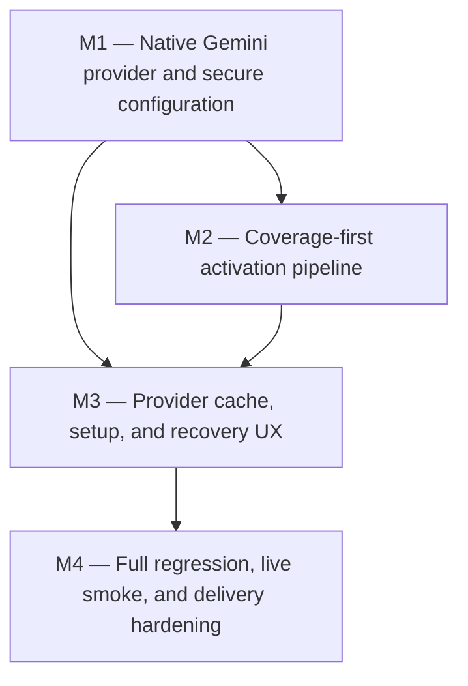

# Development Plan — Eclipse: Context Traps Reliability Fix

## 1. Context & Source Map

This is a corrective plan for the existing Chrome Manifest V3 implementation. The original product contract remains authoritative for the learner experience, privacy boundary, DOM safety, deterministic demo, and explicit exclusions; the 2026-08-08 correction request supersedes its OpenAI-specific provider choice and its acceptance of `NO_ELIGIBLE_TRAPS` on otherwise suitable ordinary articles. Repository inspection shows that the current implementation passes its catalog-focused suite but cannot invoke AI when the catalog produces zero placements, does not load the documented `.env`, does not use its provider cache, and has no browser test of a real provider-backed zero-catalog activation.

| Plan area                                                                                                                  | Source and evidence                                                                                                                                                                                                                                                                                                                                                                                                        | Capabilities traced                                                                                                                                                         |
| -------------------------------------------------------------------------------------------------------------------------- | -------------------------------------------------------------------------------------------------------------------------------------------------------------------------------------------------------------------------------------------------------------------------------------------------------------------------------------------------------------------------------------------------------------------------- | --------------------------------------------------------------------------------------------------------------------------------------------------------------------------- |
| Product flow, French locale, calibration, mastery, scheduling, DOM restoration, accessibility, permissions, and exclusions | `/Users/william/.codex/attachments/8b40ac75-e349-4d34-a2fc-704563b0f1ca/pasted-text.txt` lines 1–515, 583–908                                                                                                                                                                                                                                                                                                              | Preserve every proposed core feature and the catalog-first offline demo while correcting ordinary-page coverage.                                                            |
| Generated-trap request, validation, privacy, failure mapping, and tests                                                    | Source brief lines 516–581 and 682–855                                                                                                                                                                                                                                                                                                                                                                                     | Bounded sentence-only requests, structured output, provider failure isolation, safe rendering, API and browser regression coverage.                                         |
| Correction scope                                                                                                           | User request dated 2026-08-08                                                                                                                                                                                                                                                                                                                                                                                              | Fix widespread `No French context traps fit this article yet`; enable AI with Gemini 3.5 Flash-Lite; produce a development plan rather than product code.                   |
| Premature no-trap return and provider/session race                                                                         | `src/content/session.ts` activation and augmentation; `src/entrypoints/background.ts` session creation and `GENERATE_TRAPS`; `tests/dom/provider-augmentation.test.ts`; `tests/e2e/eclipse.spec.ts`                                                                                                                                                                                                                        | AI must be able to supply the initial 2–4 traps when the catalog finds none; generation must be authorized against a pending/active matching session.                       |
| Narrow catalog and article/sentence harvesting                                                                             | `src/catalog/french-catalog.ts`; `src/content/article.ts`; `src/content/place-traps.ts`; `docs/KNOWN_LIMITATIONS.md`                                                                                                                                                                                                                                                                                                       | Retain curated deterministic behavior, improve representative sentence selection, and cover ordinary article layouts without weakening DOM exclusions.                      |
| Incomplete provider setup                                                                                                  | `server/providers/openai.ts`; `server/index.ts`; `.env.example`; `package.json`; `src/storage/provider-settings.ts`                                                                                                                                                                                                                                                                                                        | Replace the OpenAI-specific adapter with the native Gemini server adapter, load validated runtime configuration, and make exact extension-origin setup observable.          |
| Unused provider cache and incomplete reset                                                                                 | `src/storage/provider-cache.ts`; `src/storage/profile-store.ts`; `src/entrypoints/background.ts`; cache tests and privacy docs                                                                                                                                                                                                                                                                                             | Integrate bounded hash-keyed caching, version cache identity, revalidate reads, and clear provider data on confirmed reset.                                                 |
| Current verification and release evidence                                                                                  | `package.json`, `package-lock.json`, `wxt.config.ts`, `playwright.config.ts`, `.output/chrome-mv3/manifest.json`; planning audit ran `npm run check` and `npm run test:e2e` successfully on 2026-08-08                                                                                                                                                                                                                     | Keep Node 22/npm/WXT/TypeScript/Vitest/Playwright; preserve the production permission audit and packaged extension workflow.                                                |
| Current Gemini contract                                                                                                    | [Gemini 3.5 Flash-Lite model](https://ai.google.dev/gemini-api/docs/models/gemini-3.5-flash-lite), [latest-model migration guide](https://ai.google.dev/gemini-api/docs/latest-model), [structured outputs](https://ai.google.dev/gemini-api/docs/structured-output), [API-key security](https://ai.google.dev/gemini-api/docs/api-key), and [logging/storage policy](https://ai.google.dev/gemini-api/docs/logs-datasets) | Use model ID `gemini-3.5-flash-lite`, native structured output, server-side secret handling, no tools, no deprecated sampling parameters, and request-level `store: false`. |

## 2. Assumptions & Gaps

> ASSUMPTION: “Fixed-version” means a corrective plan for the current `0.1.0` codebase, not authorization to invent a new semantic version. The source contract explicitly calls the release target unversioned.

> ASSUMPTION: “All proposed features” preserves the source brief’s core flow and explicit exclusions. PDFs, iframes, host-page Shadow DOM, dynamic feeds, automatic navigation activation, accounts, telemetry, and additional language pairs remain out of scope.

> ASSUMPTION: AI remains an explicit user opt-in because the approved manifest and privacy contract require an optional localhost host permission. When enabled and the catalog cannot supply two traps, Gemini becomes a bounded activation dependency; it is never required for the deterministic demos or offline catalog matches.

> ASSUMPTION: The supplied Gemini credential is runtime input only. It must be placed in a gitignored local environment variable named `GEMINI_API_KEY`, never copied into source, documentation, tests, build artifacts, extension storage, logs, or generated planning files. Because it was shared in chat, the owner should rotate/restrict it before release and use an authorization key compatible with Google’s September 2026 requirements.

> ASSUMPTION: The local server continues to bind to loopback and accepts only exact configured origins. The unpacked extension’s runtime ID is discovered during setup and added as an exact `chrome-extension://<id>` allowlist entry; wildcard extension origins are not permitted.

> GAP: The live credential’s validity, quota, billing tier, model entitlement, and origin restriction were not exercised during planning. M4 contains a manual live-provider smoke gate; fake-provider automation remains mandatory and cannot substitute for that one live check.

> GAP: No version bump, changelog policy, tag, deployment target, or Chrome Web Store workflow is source-authorized. The release remains `unversioned`, with publication not requested.

## 3. Dependency Graph

## 4. Release Trains

| Target release | Included milestones | Preparation trigger                            | Required artifacts | Verification                                                                                                                                                                                                                                 | Publication   |
| -------------- | ------------------- | ---------------------------------------------- | ------------------ | -------------------------------------------------------------------------------------------------------------------------------------------------------------------------------------------------------------------------------------------- | ------------- |
| `unversioned`  | M1, M2, M3, M4      | All included milestones are externally merged. | none               | From the merged release head run `npm ci`, `npm run check`, `npm run test:e2e`, `npm run zip`, the M4 live Gemini/manual checklist, manifest audit, and packaged-secret scan; every automated command exits 0 and every manual check passes. | not requested |

Release preparation is assigned once to the unversioned train, after M4 is externally merged. No milestone may bump a version, write a changelog, create a tag, publish, or submit to the Chrome Web Store.

## 5. Plan Evolution Protocol

- The committed plan and prompt files are authoritative. The ignored history ledger is reconstructible local evidence.
- Before each milestone, inspect its current plan/prompt, source map, current codebase, merged predecessor diffs, predecessor verification/CI evidence, and the local history when available.
- Record exactly one `DESIGN GO — PLAN REVISION: none`, `DESIGN GO — PLAN REVISION: <entry IDs>`, or `DESIGN NO-GO — REASON: <blocking evidence>`.
- A material mismatch updates the current milestone and every directly or transitively affected future milestone in both authoritative files. Recompute the dependency graph, critical path, and release-train membership when affected.
- `DESIGN NO-GO` blocks code, branches, and implementation PRs. A material plan revision requires a docs-only reconciliation PR that is reviewed, green, and externally merged before implementation.

## 6. Sections & Milestones

### Section A — Provider Foundation

#### M1 — Native Gemini provider and secure configuration

| Field               | Value                                                                                                                                                                                                                                                                                                                                                                                                                                                                                                                                                                                                                                                                                                                                                                                                                                                               |
| ------------------- | ------------------------------------------------------------------------------------------------------------------------------------------------------------------------------------------------------------------------------------------------------------------------------------------------------------------------------------------------------------------------------------------------------------------------------------------------------------------------------------------------------------------------------------------------------------------------------------------------------------------------------------------------------------------------------------------------------------------------------------------------------------------------------------------------------------------------------------------------------------------- |
| Objective           | The optional localhost API starts from validated local configuration and generates schema-valid French traps through the native Gemini API using model `gemini-3.5-flash-lite`, while the extension, repository, logs, and artifacts contain no credential.                                                                                                                                                                                                                                                                                                                                                                                                                                                                                                                                                                                                         |
| In / Out of scope   | **In:** replace the OpenAI-specific adapter/dependency and provider tags; use the current official `@google/genai` v2-or-newer stable SDK pinned exactly at implementation time; use native structured output with the existing Zod/JSON contract; set request-level `store: false`; use no tools; omit deprecated sampling parameters; load/validate `.env`; map Gemini auth, quota, timeout, unavailable, and malformed-output failures to existing typed errors; expose content-free health/config diagnostics; exact extension-origin allowlisting. **Out:** changing page activation/placement, direct browser-to-Gemini calls, committing a key, deployment, model fallback to a different family.                                                                                                                                                            |
| Depends on          | `none`                                                                                                                                                                                                                                                                                                                                                                                                                                                                                                                                                                                                                                                                                                                                                                                                                                                              |
| Target release      | `unversioned`                                                                                                                                                                                                                                                                                                                                                                                                                                                                                                                                                                                                                                                                                                                                                                                                                                                       |
| Deliverables        | Provider-neutral server interfaces and explicit generated-candidate sentence references; native Gemini adapter and fake adapter; `GEMINI_API_KEY`, `GEMINI_MODEL=gemini-3.5-flash-lite`, provider mode, port, and exact-origin configuration with startup validation; server-only key use; updated runtime schemas/provider discriminants and cache compatibility handling; setup/health response that reports enabled provider/model without secrets or submitted content; pinned dependency and lockfile changes.                                                                                                                                                                                                                                                                                                                                                 |
| Acceptance          | 1. With fake provider configuration, a valid request returns only validated `provider: "gemini"` candidates bound to submitted sentence IDs. 2. With Gemini mode and no key, startup/health and generation report a typed disabled/configuration state without crashing. 3. A mocked native SDK call asserts model `gemini-3.5-flash-lite`, structured response schema, `store: false`, no tools, and no deprecated sampling fields. 4. Invalid origin, auth, quota/rate limit, timeout, non-JSON, wrong locale, unsafe content, and low-confidence output map to typed failures or rejected candidates. 5. `.env` is actually loaded by `npm run api`; the sample contains placeholders only. 6. Tracked source, production bundles, zip inputs, tests, and logs contain no API-key value. 7. Only exact configured localhost/demo/extension origins are accepted. |
| Verification        | `npx vitest run tests/api/context-traps.test.ts tests/unit/trap-validation.test.ts` exits 0; `npm run check` exits 0; `node -e "const p=require('./package.json'); if(!p.dependencies?.['@google/genai']                                                                                                                                                                                                                                                                                                                                                                                                                                                                                                                                                                                                                                                            |     | p.dependencies?.openai |     | p.devDependencies?.openai) process.exit(1)"`exits 0;`git grep -nE 'GEMINI_API_KEY=[^[:space:]]+' -- ':!.env.example' ':!.docs/*'`returns no matches; start the API once with fake configuration and verify`/health` reports provider/model/configuration but no key or content. |
| Design reevaluation | Inspect the official Gemini model, JavaScript SDK, structured-output, key-security, and logging/storage documentation; current server schemas; Chrome extension origin behavior; and merged M1 verification. If the API shape, provider envelope, model ID, privacy/storage behavior, or error mapping changes, review M2, M3, and M4.                                                                                                                                                                                                                                                                                                                                                                                                                                                                                                                              |
| Risks & rollback    | Native SDK/schema drift, leaked credentials, a misleading privacy claim, and allowlist lockout are primary risks. Keep all provider calls server-side, retain the fake adapter, fail closed on invalid configuration/output, and roll back the M1 stack as a unit. A live key is never part of rollback material.                                                                                                                                                                                                                                                                                                                                                                                                                                                                                                                                                   |
| Est. PRs            | 3                                                                                                                                                                                                                                                                                                                                                                                                                                                                                                                                                                                                                                                                                                                                                                                                                                                                   |

### Section B — Coverage and Session Correctness

#### M2 — Coverage-first activation pipeline

| Field               | Value                                                                                                                                                                                                                                                                                                                                                                                                                                                                                                                                                                                                                                                                                                                                                                                                                                                                                                                                                                                                                                                                                                                  |
| ------------------- | ---------------------------------------------------------------------------------------------------------------------------------------------------------------------------------------------------------------------------------------------------------------------------------------------------------------------------------------------------------------------------------------------------------------------------------------------------------------------------------------------------------------------------------------------------------------------------------------------------------------------------------------------------------------------------------------------------------------------------------------------------------------------------------------------------------------------------------------------------------------------------------------------------------------------------------------------------------------------------------------------------------------------------------------------------------------------------------------------------------------------- |
| Objective           | An eligible ordinary English article can receive 2–4 safe traps when AI is enabled even when the deterministic catalog has zero matches, while catalog-backed pages remain fast, deterministic, offline-capable, and safely restorable.                                                                                                                                                                                                                                                                                                                                                                                                                                                                                                                                                                                                                                                                                                                                                                                                                                                                                |
| In / Out of scope   | **In:** score viable article roots by eligible readable body content; harvest up to eight representative, replaceable, length-bounded sentences across distinct blocks rather than only each block’s first sentence; authorize generation against a matching pending/active session; request AI before final `NO_ELIGIBLE_TRAPS` when catalog placements are below two; explicitly bind every generated candidate to its submitted sentence; validate/re-rank catalog and Gemini candidates through one global 2–4 trap selection/placement pass; retain rollback and DOM invalidation behavior; honest provider-aware empty states. **Out:** weakening excluded-ancestor rules, crossing text nodes, modifying dynamic content, broad host permissions, automatic activation, full-page translation.                                                                                                                                                                                                                                                                                                                  |
| Depends on          | `M1`                                                                                                                                                                                                                                                                                                                                                                                                                                                                                                                                                                                                                                                                                                                                                                                                                                                                                                                                                                                                                                                                                                                   |
| Target release      | `unversioned`                                                                                                                                                                                                                                                                                                                                                                                                                                                                                                                                                                                                                                                                                                                                                                                                                                                                                                                                                                                                                                                                                                          |
| Deliverables        | Pending-session authorization lifecycle with session ID validation and cleanup; provider-aware activation state machine; reusable candidate envelope carrying `sentenceId` without parsing IDs; representative sentence selector; merged candidate scoring/placement path with one-per-block/sentence/concept, non-overlap, density, and 2–4 limits; ordinary-layout DOM fixtures; revised error semantics that distinguish no article, AI disabled, AI unavailable, and no validated candidates without exposing content.                                                                                                                                                                                                                                                                                                                                                                                                                                                                                                                                                                                             |
| Acceptance          | 1. A long eligible article with zero catalog matches and a fake enabled provider activates with 2–4 French traps. 2. The same page with AI disabled makes no network request and returns the honest no-candidate state. 3. When catalog supplies at least two traps, activation succeeds without waiting on a slow provider and provider failure cannot remove a catalog trap. 4. When catalog supplies zero or one, activation waits only for the bounded provider attempt, succeeds if the merged result reaches two, and otherwise restores/changes no host DOM before returning a typed recoverable result. 5. Generation is accepted only for the same sender tab and exact pending/active session ID; failure/replacement clears pending state. 6. Generated traps cannot target an unsent sentence or unreplaceable/cross-node span. 7. All original article exclusions, restoration, idempotency, due-priority, and 2–4/3% limits remain green. 8. Fixtures representing semantic `<article>`, `<main>`, nested news layouts, inline links/emphasis, and catalog-free prose all have binary expected outcomes. |
| Verification        | `npx vitest run tests/dom/article.test.ts tests/dom/provider-augmentation.test.ts tests/dom/session.test.ts tests/dom/transfer.test.ts tests/unit/selection.test.ts` exits 0; `npm run check` exits 0; a minimum manual check on one catalog-free local fixture with fake AI shows 2–4 tokens, then End Eclipse restores normalized visible text exactly.                                                                                                                                                                                                                                                                                                                                                                                                                                                                                                                                                                                                                                                                                                                                                              |
| Design reevaluation | Inspect M1’s generated-candidate and error contracts, background/content session ownership, merged M1 verification, current article fixtures, provider latency evidence, and every placement/restoration invariant. If session authorization, activation timing, candidate identity, or merged selection changes, review M3 and M4.                                                                                                                                                                                                                                                                                                                                                                                                                                                                                                                                                                                                                                                                                                                                                                                    |
| Risks & rollback    | Awaiting AI can make Start feel slow; async results can mutate ended sessions; merged candidates can bypass density/restoration rules. Bound the fallback wait, authorize by tab plus session ID, ignore late results, perform no DOM mutation before a valid placement plan, and preserve catalog-fast behavior. Roll back the M2 stack as a unit.                                                                                                                                                                                                                                                                                                                                                                                                                                                                                                                                                                                                                                                                                                                                                                    |
| Est. PRs            | 3                                                                                                                                                                                                                                                                                                                                                                                                                                                                                                                                                                                                                                                                                                                                                                                                                                                                                                                                                                                                                                                                                                                      |

### Section C — Reliability and User Control

#### M3 — Provider cache, setup, and recovery UX

| Field               | Value                                                                                                                                                                                                                                                                                                                                                                                                                                                                                                                                                                                                                                                                                                                                                                                                      |
| ------------------- | ---------------------------------------------------------------------------------------------------------------------------------------------------------------------------------------------------------------------------------------------------------------------------------------------------------------------------------------------------------------------------------------------------------------------------------------------------------------------------------------------------------------------------------------------------------------------------------------------------------------------------------------------------------------------------------------------------------------------------------------------------------------------------------------------------------- |
| Objective           | Users can understand, enable, diagnose, disable, and reset Gemini-backed traps, while validated hash-keyed cache hits reduce repeated calls without storing sentence text or reviving stale provider output.                                                                                                                                                                                                                                                                                                                                                                                                                                                                                                                                                                                               |
| In / Out of scope   | **In:** integrate the existing bounded provider cache into generation; include locale, model, prompt/schema revision, and normalized sentence hash in cache identity; revalidate cached candidates and bind them to the current sentence reference; retain 100-entry LRU behavior; clear/invalidate incompatible cache; expose popup states for setup required, permission denied, server unavailable, ready, generating, fallback, and last typed error; exact-origin guidance; revoke permission on disable; confirmed reset clears all documented Eclipse keys. **Out:** storing page text, URLs, profiles, raw prompts/responses, analytics, silent retries, remote secret entry in the popup.                                                                                                         |
| Depends on          | `M1`, `M2`                                                                                                                                                                                                                                                                                                                                                                                                                                                                                                                                                                                                                                                                                                                                                                                                 |
| Target release      | `unversioned`                                                                                                                                                                                                                                                                                                                                                                                                                                                                                                                                                                                                                                                                                                                                                                                              |
| Deliverables        | Runtime cache read/write path and versioned cache key; content-free cache telemetry limited to local counts/status; provider readiness/health contract; accessible popup guidance and nonblocking status; corrected reset semantics for profile, interactions, provider settings/cache, and active session; privacy copy that accurately describes Gemini data transfer and does not repeat OpenAI-only claims.                                                                                                                                                                                                                                                                                                                                                                                            |
| Acceptance          | 1. Repeating a sentence with the same model/prompt/schema uses a revalidated cache result and performs no second provider call. 2. Model, prompt/schema revision, locale, or malformed cached output causes a miss; sentence text is absent from storage. 3. Cache never exceeds 100 entries and maintains deterministic LRU eviction. 4. Enabling AI requests only `http://localhost:8787/*`; denial leaves AI off; disabling revokes it. 5. Popup reports actionable setup versus auth/quota/timeout/invalid-output states without page/model content. 6. Confirmed reset ends the active session, restores the page, clears profile, interaction log, provider settings, and provider cache, and returns to calibration; cancel changes nothing. 7. Keyboard and screen-reader behavior remains intact. |
| Verification        | `npx vitest run tests/unit/provider-cache.test.ts tests/unit/profile-store.test.ts tests/dom/provider-augmentation.test.ts tests/dom/overlay.test.tsx` exits 0; `npm run check` exits 0; `npm run test:e2e` exits 0 for fake-provider toggle/cache/reset scenarios; inspect `chrome.storage.local` in the test harness and assert that submitted sentence substrings and API credentials are absent.                                                                                                                                                                                                                                                                                                                                                                                                       |
| Design reevaluation | Inspect the merged M1/M2 provider envelope, model/prompt revision, cache schema and migration evidence, popup message contract, reset key inventory, manifest permissions, and privacy source. If cache identity, stored shapes, permissions, or reset scope changes, review M4.                                                                                                                                                                                                                                                                                                                                                                                                                                                                                                                           |
| Risks & rollback    | Stale cache can teach incorrect French; setup detail can leak origins; reset is destructive. Revalidate every read, namespace by generation contract, show no sentence content, require explicit confirmation, test the exact deleted key set, and roll back the M3 stack as a unit.                                                                                                                                                                                                                                                                                                                                                                                                                                                                                                                       |
| Est. PRs            | 3                                                                                                                                                                                                                                                                                                                                                                                                                                                                                                                                                                                                                                                                                                                                                                                                          |

### Section D — End-to-End Acceptance

#### M4 — Full regression, live smoke, and delivery hardening

| Field               | Value                                                                                                                                                                                                                                                                                                                                                                                                                                                                                                                                                                                                                                                                                                                                                                                                                                                                                                                                                                                                                                                                                                                                                                       |
| ------------------- | --------------------------------------------------------------------------------------------------------------------------------------------------------------------------------------------------------------------------------------------------------------------------------------------------------------------------------------------------------------------------------------------------------------------------------------------------------------------------------------------------------------------------------------------------------------------------------------------------------------------------------------------------------------------------------------------------------------------------------------------------------------------------------------------------------------------------------------------------------------------------------------------------------------------------------------------------------------------------------------------------------------------------------------------------------------------------------------------------------------------------------------------------------------------------- |
| Objective           | The complete original product flow and corrected Gemini coverage path are demonstrated in browser automation and one explicit live-provider smoke test, with accurate docs and a secret-free production package ready for the unversioned release gate.                                                                                                                                                                                                                                                                                                                                                                                                                                                                                                                                                                                                                                                                                                                                                                                                                                                                                                                     |
| In / Out of scope   | **In:** Playwright fake-provider server and deterministic zero-catalog fixtures; end-to-end provider permission/setup, initial AI fallback, cache, late result, failure fallback, reset, and restoration scenarios; regression of calibration, Truth Card, mastery, due transfer, accessibility, session replacement, service-worker restart, offline catalog use, manifest permissions, docs, troubleshooting, privacy, demo/judge materials; one manual live Gemini smoke using the supplied-or-rotated key from `.env`. **Out:** CI calls to paid Gemini, deployment, publication, Chrome Web Store submission, new features outside the source contract.                                                                                                                                                                                                                                                                                                                                                                                                                                                                                                                |
| Depends on          | `M3`                                                                                                                                                                                                                                                                                                                                                                                                                                                                                                                                                                                                                                                                                                                                                                                                                                                                                                                                                                                                                                                                                                                                                                        |
| Target release      | `unversioned`                                                                                                                                                                                                                                                                                                                                                                                                                                                                                                                                                                                                                                                                                                                                                                                                                                                                                                                                                                                                                                                                                                                                                               |
| Deliverables        | Browser-controlled fake generation API; provider-backed generic article fixture; regression matrix mapping every source capability to automated/manual evidence; updated README/architecture/privacy/limitations/demo instructions; content-free operational diagnostics; live smoke checklist; release-head zip and secret/manifest audit instructions (zip creation occurs only after the train merges).                                                                                                                                                                                                                                                                                                                                                                                                                                                                                                                                                                                                                                                                                                                                                                  |
| Acceptance          | 1. Browser automation enables fake AI and turns a catalog-free eligible article into 2–4 answerable French traps, then restores the page. 2. Fake auth denial, timeout, invalid output, zero output, and late output never leave partial DOM or corrupt a session; catalog pages still work offline. 3. Calibration/skip, answer/Truth Card, moon/mastery, due transfer, duplicate-answer protection, reset confirmation, accessibility, session replacement, worker restart, French NFC, and exact manifest permissions all pass. 4. A manual live run starts the local server from gitignored configuration, reports model `gemini-3.5-flash-lite`, enables AI through the popup, and produces validated traps on at least two catalog-free English articles; auth/quota failure instead blocks release with its typed evidence. 5. No key, `.env`, sentence text, or generated content appears in tracked files, logs, extension storage, production source maps, manifest, or zip. 6. Documentation accurately states that sentences are sent to Google only when AI is enabled and distinguishes free/paid data handling without promising unsupported zero retention. |
| Verification        | `npm ci`, `npm run check`, and `npm run test:e2e` exit 0; after all train milestones merge, `npm run zip` exits 0; `unzip -l .output/eclipse-context-traps-0.1.0-chrome.zip` shows production extension files only; `git grep -nE 'GEMINI_API_KEY=[^[:space:]]+' -- ':!.env.example' ':!.docs/*'` returns no matches; the production manifest audit reports exactly `activeTab`, `scripting`, `storage`, optional `http://localhost:8787/*`, and no forbidden access; complete and sign the manual live-smoke checklist without recording the key or submitted sentences.                                                                                                                                                                                                                                                                                                                                                                                                                                                                                                                                                                                                   |
| Design reevaluation | Inspect all merged milestone diffs and verification, current official Gemini model/key/data documentation, full source-to-test traceability, production manifest/zip, and live smoke evidence. A provider/model/privacy or permission mismatch requires M1–M3 impact review and docs-only reconciliation before release preparation.                                                                                                                                                                                                                                                                                                                                                                                                                                                                                                                                                                                                                                                                                                                                                                                                                                        |
| Risks & rollback    | Browser automation can pass while a real key/model fails; live calls may incur quota/cost; docs can overstate privacy; packaging can leak local files. Keep live calls manual and bounded, require typed evidence, never log content, inspect the archive, and roll back M4 separately if it changes only tests/docs; otherwise roll back the affected predecessor stack too.                                                                                                                                                                                                                                                                                                                                                                                                                                                                                                                                                                                                                                                                                                                                                                                               |
| Est. PRs            | 2                                                                                                                                                                                                                                                                                                                                                                                                                                                                                                                                                                                                                                                                                                                                                                                                                                                                                                                                                                                                                                                                                                                                                                           |

## 7. Cross-Cutting Concerns

| Concern                            | Contract                                                                                                                                                                                                                                                                              |
| ---------------------------------- | ------------------------------------------------------------------------------------------------------------------------------------------------------------------------------------------------------------------------------------------------------------------------------------- |
| Secrets                            | Gemini credentials stay server-side in environment variables. Never place a key in extension code/storage, React state, messages, docs, tests, logs, source maps, or zip. Prefer a rotated/restricted authorization key and keep fake-provider automation keyless.                    |
| Privacy                            | AI remains opt-in. Send only up to eight selected sentences, never URL/title/profile/history/identity. Use the native Interactions API with structured output, request-level `store: false`, no tools, and accurate documentation of Google’s applicable free/paid data terms.        |
| Prompt injection and output safety | Treat page sentences as untrusted data; use a fixed system instruction and strict schema; bind candidates to submitted sentence IDs; re-run all content, locale, confidence, exact-source, clue, choice, HTML/URL/instruction, and DOM-range validations before selection or caching. |
| Permissions                        | Preserve `activeTab`, `scripting`, and `storage`; preserve only optional `http://localhost:8787/*`; do not add `<all_urls>`, `tabs`, history, cookies, remote Gemini host permissions, declarative content scripts, or web-accessible resources.                                      |
| DOM safety                         | Plan all placements before mutation; mutate only replaceable single text-node ranges; keep one trap per block/sentence/concept, no overlaps, max four and 3% density; ignore late provider results; restore immediate parents and verify normalized visible text.                     |
| Availability and performance       | Catalog pages activate immediately and work offline. AI is attempted only when enabled, is bounded by current sentence/body/time/rate limits, has no activation retry, and can use revalidated local cache. Provider failures are typed and recoverable.                              |
| Data compatibility                 | Learner profile schema remains compatible. Provider-tag/cache changes invalidate or migrate provider cache only; they must not discard mastery. Confirmed reset is the only user-data deletion path.                                                                                  |
| Observability                      | Local logs contain event names, duration, counts, model ID, and error codes only. No origin, sentence, generated text, learner data, or credential. Popup status uses typed, actionable, content-free errors.                                                                         |
| Accessibility                      | Preserve keyboard tokens/choices, focus trap and return, Escape close, live result announcements, non-color correctness, 40×40 targets, contrast, and reduced motion across new generating/error states.                                                                              |
| Release management                 | One unversioned train. No version/changelog/tag/publication work. Run release preparation once from merged M4 head and preserve the production permission and secret audits.                                                                                                          |

## 8. Critical Path

| Order | Milestone                                                | Exit evidence                                                                                                                     | Release state                                |
| ----- | -------------------------------------------------------- | --------------------------------------------------------------------------------------------------------------------------------- | -------------------------------------------- |
| 1     | M1 — Native Gemini provider and secure configuration     | Native/mocked Gemini contract, secure config, API tests, and `npm run check` green.                                               | unversioned preparation pending              |
| 2     | M2 — Coverage-first activation pipeline                  | Catalog-free fake-AI article produces 2–4 safe traps; catalog/restoration regression green.                                       | unversioned preparation pending              |
| 3     | M3 — Provider cache, setup, and recovery UX              | Runtime cache, permission/setup states, and exact reset semantics pass unit/DOM/E2E checks.                                       | unversioned preparation pending              |
| 4     | M4 — Full regression, live smoke, and delivery hardening | Full automated suite, manifest/secret audits, and manual live Gemini smoke pass.                                                  | eligible to merge; preparation still pending |
| 5     | Unversioned release preparation                          | All M1–M4 externally merged; `npm ci`, check, E2E, zip, live/manual checklist, manifest and archive audits pass from merged head. | ready; publication not requested             |
