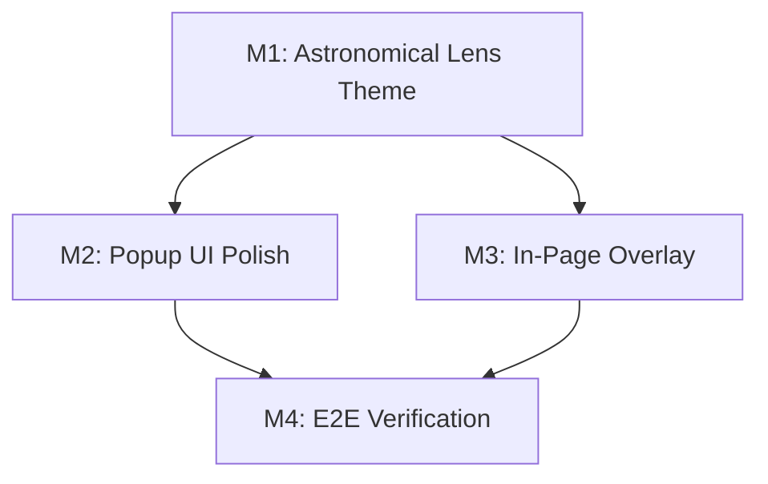

# Development Plan — Eclipse UI & UX Refinement (Astronomical Lens Edition)

## 1. Context & Source Map

This plan outlines the visual refinement and user experience enhancement for the Eclipse Chrome Extension (Popup UI & In-Page Overlay), applying an **"Astronomical Lens"** design system (Deep Obsidian background, Lunar Gold accents, Deep Sapphire Glass cards, tactile keycaps, and micro-animations) while strictly preserving all underlying domain logic, message contracts, and test suites.

| Section / Milestone | Description | Source Files |
| --- | --- | --- |
| M1 — Astronomical Lens Theme & CSS Tokens | Glassmorphism, tactile keycaps, lunar gold glow, token underlines | `src/content/ui/theme.ts`, `src/entrypoints/popup/popup.css` |
| M2 — Popup UI Polish | Header halo, DELF level selector cards, stat grid, diagnostic hero | `src/entrypoints/popup/App.tsx`, `src/content/ui/Moon.tsx` |
| M3 — In-Page Overlay & Truth Card | Glass card modal, keycaps [1, 2, 3], DELF badge pills, result feedback glow | `src/content/ui/ChallengeOverlay.tsx` |
| M4 — Verification & QA | Unit, DOM, and Playwright E2E verification | `tests/` |

## 2. Assumptions & Gaps

> ASSUMPTION: All core domain schemas, message validation protocols, and storage persistence models remain 100% untouched.

## 3. Dependency Graph

## 4. Release Trains

| Target release | Included milestones | Preparation trigger | Required artifacts | Verification | Publication |
| --- | --- | --- | --- | --- | --- |
| v0.2.0 | M1, M2, M3, M4 | All milestones merged | CHANGELOG.md | `npm run check && npx playwright test` | build artifact |

## 5. Plan Evolution Protocol

- The committed plan and prompt files are authoritative.
- Before each milestone, inspect current plan, code diffs, and verification outputs.
- A material plan change must update the plan and prompts before code changes start.

## 6. Sections & Milestones

### Section A — Visual & UX Refinement

#### M1 — Astronomical Lens Theme & CSS Tokens
| Field | Value |
| --- | --- |
| Objective | Upgrade design system with glassmorphism backdrop blurs (`backdrop-filter: blur(16px)`), Lunar Gold accents (`#F7C948`), tactile keycaps, and smooth micro-animations. |
| In / Out of scope | CSS & theme tokens only. No HTML structural breakages. |
| Depends on | none |
| Target release | v0.2.0 |
| Deliverables | Updated `theme.ts` & `popup.css`. |
| Acceptance | All elements render with high-contrast, glowing glass cards, and smooth hover/active transitions. |
| Verification | `npm run check` passes. |
| Est. PRs | 1 |

#### M2 — Popup UI Polish
| Field | Value |
| --- | --- |
| Objective | Polish Popup layout: header SVG Moon halo, DELF selector grid cards, diagnostic hero breakdown, stat counters, and primary action buttons. |
| In / Out of scope | React component markup and CSS styling in Popup. |
| Depends on | M1 |
| Target release | v0.2.0 |
| Deliverables | Updated `App.tsx` and `Moon.tsx`. |
| Acceptance | Popup renders crisp at 340px width with glowing header, DELF picker grid, and smooth status transitions. |
| Verification | `npm run check && npx playwright test` passes. |
| Est. PRs | 1 |

#### M3 — In-Page Overlay & Truth Card
| Field | Value |
| --- | --- |
| Objective | Elevate in-page challenge modal with smooth scale entrance, shortcut keycap badges (`1`, `2`, `3`), DELF badge pills, and ambient glowing truth cards. |
| In / Out of scope | ChallengeOverlay component styling & markup polish. |
| Depends on | M1 |
| Target release | v0.2.0 |
| Deliverables | Updated `ChallengeOverlay.tsx`. |
| Acceptance | Modal overlay opens with blurred backdrop, focused keypresses work cleanly, result card displays ambient glow. |
| Verification | `npm run check && npx playwright test` passes. |
| Est. PRs | 1 |

#### M4 — E2E Verification & Quality Gate
| Field | Value |
| --- | --- |
| Objective | Execute full automated verification suite to guarantee zero regressions. |
| In / Out of scope | Test suite execution. |
| Depends on | M2, M3 |
| Target release | v0.2.0 |
| Deliverables | Passing test suite across 325 unit/DOM tests and 41 Playwright E2E tests. |
| Acceptance | 100% green tests. |
| Verification | `npm run check && npx playwright test` |
| Est. PRs | 1 |

## 7. Critical Path

M1 → M2 & M3 → M4 → Release v0.2.0.
